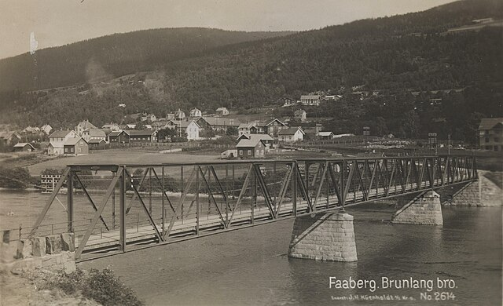

# Methods {#sec-methods}

## Design

A two-arm parallel-group randomised controlled trial.

## Participants

Sixty-two community-dwelling adults aged 65–79 years were recruited from the
Lillehammer and Gjøvik areas.

{#fig-site width=70%}

@fig-site shows one of the recruitment areas.

## Outcomes

The primary outcome was change in peak oxygen uptake from baseline to week 12.

## Statistical analysis

Group differences were estimated with a linear mixed model. Effect sizes are
reported as standardised mean differences [@cohen1988].

The sample size calculation assumed the standard formula

$$
n = \frac{2(z_{1-\alpha/2} + z_{1-\beta})^2 \sigma^2}{\Delta^2}
$$ {#eq-samplesize}

with $\Delta$ the smallest difference of interest. @eq-samplesize gave 31
participants per arm.
